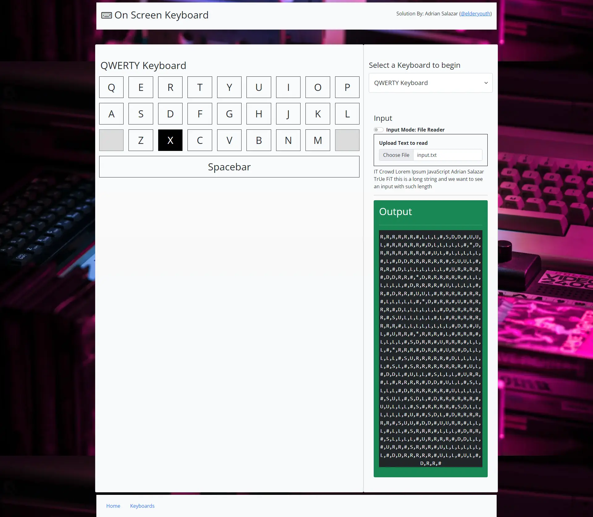

# OnScreen Keyboard (Solution)
-------------------------------


## Introduction
Welcome to the OnScreen Keyboard solution submitted by Adrian Salazar. This is a submission for the coding challenge provided by TrueFit.io

## Approach
I started with a draft solution using vanilla JavaScript and basic HTML and CSS (Bootstrap 5 as the main framework). Once the proof of concept was completed, I then focused on converting it all to a React App. The React App uses an NodeJS package called json-server as part of the backend as I was afraid there would be too many constraints for folks to run.

### Algorithm
OnScreenKeyboard algorithm can successfully generate a list of directions based on a few assumptions - we can represent the keyboard as a fully connected graph, which is also a perfect square; the number of rows is the same as columns, thus using the variable size as the n number of rows would help us traverse at a linear time complexity (`O(n)`). The second assumption is that our input is a single dimension array or that we are able to flatten it to a single dimension. The final assumption is that our keyboards will always have unique values aside from the empty entries.

Simplest way to traverse is by determining how many steps should we move vertically followed by how many steps horizontally. This can be calculated by the formulas:

- `delta_x = (x_index % size) - current_x_index`
- `delta_y = (x_index / size) - current_y_index`

`delta_x` allows us to know how many times we should move to the left or right since it is easier to treat our coordinates similar to a cartesian map (e.g `A= (0,0)` and `G = (0, 1)`).
`curr_x_index` is extracted by simply using `keyboardList.indexOf(character)`, thus making the graph extremely flexible to where it would not matter if the letter `A` was placed as the first one or as the 34th entry, `indexOf` would allow me to locate its coordinates with ease.
Finally once the delta variables were determined, I allowed the algorithm to add to a stack called 'results' the vertical and horizontal steps, what direction they were facing and how many times that ws applied. For example, `A=>H` would be `D,R#`. Vertical movement takes priority in order for the algorithm to return the correct format.
Finally, if the character was not present on the onscreen keyboard, the algorithm would simply ignore the entry. Now, depending on user requirements, it may be preferrable to handle these cases more gracefully like a warning message letting the user know the key was not valid, but since we are simulating more of a speech to text input, it would make sense to ignore special characters.

## Architecture
In order to create a visual example using React, I heavily used reducer hooks with actions defined in a context file called KeyboardContext. Reducers would allow me to not only dynamically request an output thru a textbox, but I could actually switch to use a file uploader instead and allow myself to select pre-existing keyboards. There is room for expanding this application by also adding the ability to add actions to manipulate the database directly.
I separated the database in a folder called '`backend`', at the moment of writing, the backend consists only of a singular json file.
For the application, I used two folders: '`draft`' and '`frontend`', `draft` are the remains of the first implementation using vanilla tools.

in the `frontend`, React allowed to create a robust solution where i could create custom routes, hooks, helper functions, constant variables for actions in the context provider, and many components. Feel free to reach each and let me know if there are any places to improve.

## Constraints
- Keyboard will have a `(n x n-x)` dimension where `x` is the floored remainer of `buttons.length / size`
- Keyboard list uses `db.json` as its backend, there isn't a method to add/edit/delete keyboards implemented in this solution
- Keyboard buttons are added as a single dimension array
- One output can be seen at any given time, file reader entries will be considered a single string separated by `*`, this was done in order to allow the animation to be a continuous item
- Invalid characters or characters not present in the keyboard will be ignored
- Database is simulated by a single JSON file stored under `backend`, this reduces the more complex ideas of authenticating, item management, etc since they would have taken more time to implement and was not sure to how far this challengs would want me to work on.

## Features
### Keyboard
- Keyboard Layout: Bread and butter of the frontend - displays a keyboard based on an object with the following properties: 
  - `id`: unique identifier for the keyboard
  - `title`: a user friendly name for the keyboard
  - `buttons`: an array of buttons
  - `size`: number of columns per keyboard row

- `Keyboard Buttons`: Buttons whose value is based on the button it was indexed to
- `Keyboard Reducer`: The logic to allow a lot of site interactions, including input mode toggling, input and output updates as well as keyboard selection
- `Keyboard Select`: A component that will update which keyboard the user can visualize the logic for.
- `Keyboard List Page`: Navigating to `http://localhost:3010/keyboards` will allow the user to view all available keyboards based on a JSON file stored in the `backend` folder surrogating a real database. This can be more robust by creating a proper database, but as mentioned in the constraints, it was decided to keep it simple to avoid project creep.

### Input Modes
This simulates the different ways an input can be accepted in React, whether it be a user input or a file upload. I could have set up the simple text search to display the result based on user streamed input rather than being submitted, but i decided to go for single submission to ensure the basic eaature is stable.
The following are the available input modes -
- `Simple Text Search` - single string entry, can have several spaces
- `File Reader` - allows .txt file uploads nad interprets them as a single output string (the solution can return each outut as an array entry, but visually it's a single string)


## Running the code
- On VSCode (or using gitBash and/or other code editor) open two terminals on the root folder 
> (/OnScreenKeyboard/)
- On the first terminal, use the following commands to start the backend:
  ```
  cd .. 
  cd backend/ 
  json-server --watch db.json
  ```
  -  (note, you may need to run npm install -g json-server)
- On the second terminal, run the following commands:
  ```
  npm install
  npm start
  ```
  - This should allow you to install node_modules that were not included in the pull request as well as setting the local environment to use a different port from the database
  *Please reach out to me at aasalzarmiranda@gmail.com if you run into any issues*


## Known Issues
- Keyboard animation is not set to queue several submissions.
- Constants to create keyboards and keyboard buttons are present, but they were not used for this implementation.
- Mobile view for the keyboard is not 100% the best, but can be fixed thru additional media queries.